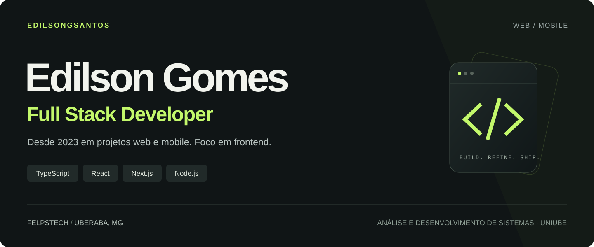

  

  <a href="https://www.linkedin.com/in/EdilsonGSantos"><strong>LinkedIn ↗</strong></a>
  &nbsp;&nbsp; / &nbsp;&nbsp;
  <a href="mailto:edilson.gs1602@gmail.com"><strong>E-mail ↗</strong></a>

## Full stack na atuação. Frontend no foco.

Sou **Edilson Gomes**, desenvolvedor na **[FelpsTech](https://www.felpstech.com/)**, em Uberaba, MG. Trabalho com programação **desde 2023** e, nesse caminho, já participei de **projetos web e mobile**.

O frontend é a parte do desenvolvimento à qual mais me dedico. É onde o código encontra quem usa o produto: na navegação, na resposta de uma interação e nos detalhes que tornam uma tela mais clara. Gosto dessa proximidade entre construção técnica e experiência de uso.

Minha atuação também passa pelo backend com **Node.js**. Entender o que acontece entre a interface e os dados faz parte da minha visão de desenvolvimento full stack e da forma como penso uma aplicação.

### O que você vai encontrar por aqui

Este perfil reúne parte do meu caminho como desenvolvedor: código, projetos e as tecnologias com as quais trabalho. Meu principal eixo é o ecossistema **JavaScript e TypeScript**, com **React e Next.js** no frontend e **Node.js** no backend.

| Frente | Meu foco |
| :--- | :--- |
| **Frontend** | Construção de interfaces web com React, Next.js e TypeScript. |
| **Backend** | Desenvolvimento com Node.js e integração entre interfaces e dados. |
| **Web e mobile** | Participação em projetos para os dois contextos, com foco principal no frontend. |

### Como penso o desenvolvimento

Uma interface chama atenção pelo visual, mas é no uso que ela mostra sua qualidade. Por isso, me interessam tanto a apresentação quanto o comportamento: como uma tela se organiza, como responde às ações e como ajuda alguém a concluir o que precisa fazer.

Também valorizo código que possa ser entendido e evoluído. Para mim, desenvolver envolve pensar na experiência de quem usa a aplicação e no trabalho de quem vai continuar construindo sobre ela.

### Minha trajetória

**Desde 2023** · Atuação em desenvolvimento e participação em projetos web e mobile.

**Atualmente** · Desenvolvedor full stack na **[FelpsTech](https://www.felpstech.com/)**, em **Uberaba, MG**, com foco em frontend.

**Formação** · Graduado em **Análise e Desenvolvimento de Sistemas pela Uniube**.

---

### Vamos conversar

Tem um projeto web ou mobile em mente, uma oportunidade ou quer trocar uma ideia sobre desenvolvimento? Você pode me encontrar no **[LinkedIn](https://www.linkedin.com/in/EdilsonGSantos)** ou escrever para **[edilson.gs1602@gmail.com](mailto:edilson.gs1602@gmail.com)**.
